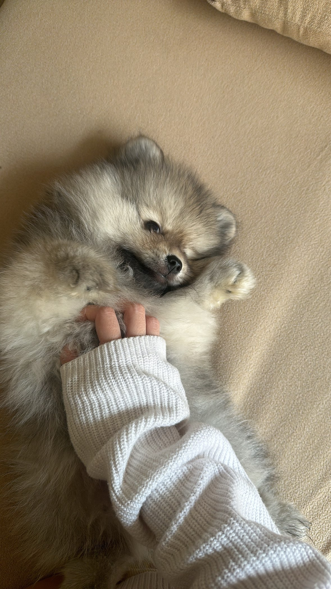

{width=250px}

Mingalabar! My name is Pai but i go by Reina. I'm from Myanmar and my family
is from the Mergui Islands. I love the sea and my favorite food is clam soup. 

Before this program, I completed my bachelors in Singapore and worked at a bank in an analyst role.
Before continuing my career in data, I chose this opportunity to study at UBC to deepen my technical skills and learn how to be better in data roles.

It's my first time living in Canada, and I'm really excited to see snow for the first time. Before you go, please say hi to my furball Kailan. 
He's the cutest little  pomsky named after a vegtable. 

To learn more about Quarto websites visit <https://quarto.org/docs/websites>.
