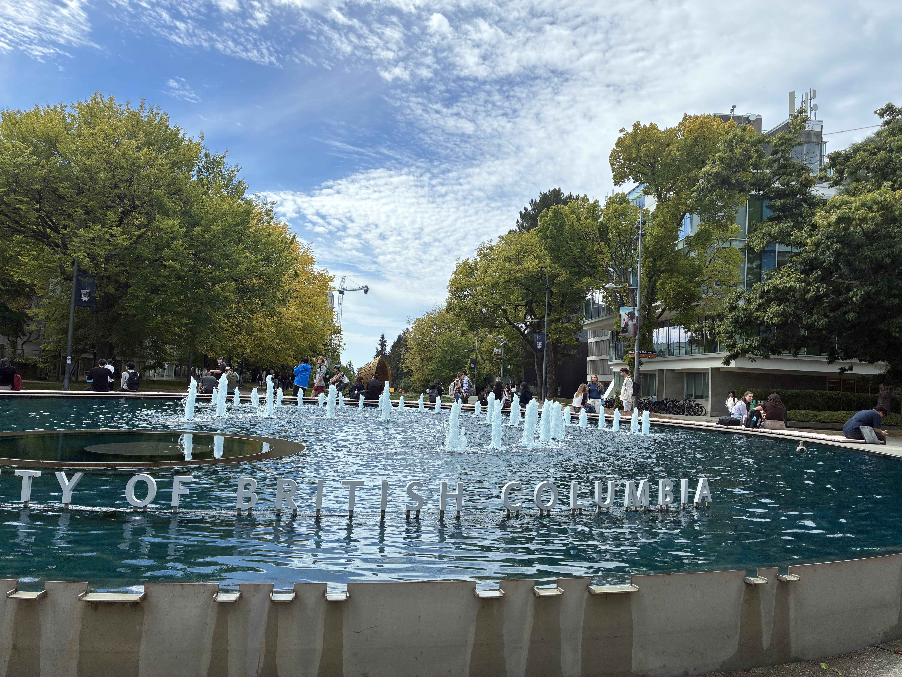

The first week was exciting yet full of challenges. Navigating where classes are and understanding how to retrieve and submit assignments were the most difficult parts. The pace was fast but I think
by mid week two, I was able to adjust my time management. I have a good idea now on where I should be putting in more work to cover all the concepts.
 I also found some nice study spots in the koerner library where it's really quiet. UBC is a big campus and there are still so many places to explore. Some of my favorite scenic places has to be the
water fountain. I also like to grab coffee and some snacks in between lectures and enjoy the seasonal drinks. It's a little self reward system that gives me something to look forward to in the day. 
It's started to be a little chilly in the mornings and I caught a small cold. But as we are settling into new routines, I am really happy to be studying at such a beautiful campus. The rain hasn't caught
up to us yet, so its a great weather to be out and about. 

 
